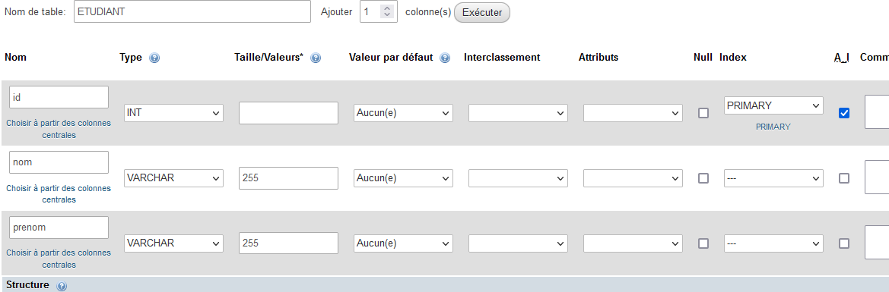

# Application de gestion des étudiants

L'objectif est de créer une application de gestion des stages des étudiants.

# Rappel

Sur la WSL, les services **apache2** et **mariadb** doivent être lancés.

```bash
sudo service apache2 start
sudo service mariadb start
```

Vous devez avoir accès au serveur web via un navigateur et travailler dans le **DocumentRoot** de votre serveur Web.

# Sommaire

<!-- TOC -->
* [Application de gestion des étudiants](#application-de-gestion-des-tudiants)
* [Rappel](#rappel)
* [Sommaire](#sommaire)
* [Base de données](#base-de-donnes)
  * [Table ETUDIANT](#table-etudiant)
  * [Requêtes à utiliser](#requtes--utiliser)
    * [Lecture](#lecture)
    * [Mise à jour](#mise--jour)
    * [Suppression](#suppression)
    * [Création](#cration)
<!-- TOC -->

***

# Base de données

> Il faut pour cette partie réaliser les tâches suivantes:
> - Accéder à PHPMyAdmin
> - Créer une base de données spécifique ainsi qu'un utilisateur spécifique
> - Créer une table **ETUDIANT** avec les champs donnés plus bas
> - Saisir des données factices
> - Commencer à rédiger les requêtes qui seront utilisées ultérieurement

Accéder à PHPMyAdmin via l'URL correpondante à votre WSL.

Ici, ce sera *http://localhost/phpmyadmin*.

## Table ETUDIANT



On crée une table **ETUDIANT** comprenant les champs suivants:
- id
  - INT AUTO_INCREMENT PRIMARY KEY
- nom
  - VARCHAR 255
- prenom
  - VARCHAR 255

## Requêtes à utiliser

### Lecture

- Lecture de tous les étudiants **findAll**
```sql
SELECT * FROM ETUDIANT;
```

- Lecture d'un étudiant en fournissant son id **findOne**
```sql
SELECT * FROM ETUDIANT WHERE id = ....;
```

### Mise à jour

```sql
UPDATE ......
```

### Suppression

```sql
DELETE ......
```

### Création

```sql
INSERT ......
```

# Fichiers HTML (FrontEnd)

Abordons maintenant l'aspect visuel.
On utilisera le framework CSS [Bootstrap](https://getbootstrap.com/).

## Code de base pour une pahe HTML utilisant Bootstrap

Rendez vous sur la [documentation](https://getbootstrap.com/docs/5.3/getting-started/introduction/) et récupérez le code de base.
> You have to speak english!

```html
<!doctype html>
<html lang="en">
  <head>
    <meta charset="utf-8">
    <meta name="viewport" content="width=device-width, initial-scale=1">
    <title>Bootstrap demo</title>
    <link href="https://cdn.jsdelivr.net/npm/bootstrap@5.3.0-alpha3/dist/css/bootstrap.min.css" rel="stylesheet" integrity="sha384-KK94CHFLLe+nY2dmCWGMq91rCGa5gtU4mk92HdvYe+M/SXH301p5ILy+dN9+nJOZ" crossorigin="anonymous">
  </head>
  <body>
    <h1>Hello, world!</h1>
    <script src="https://cdn.jsdelivr.net/npm/bootstrap@5.3.0-alpha3/dist/js/bootstrap.bundle.min.js" integrity="sha384-ENjdO4Dr2bkBIFxQpeoTz1HIcje39Wm4jDKdf19U8gI4ddQ3GYNS7NTKfAdVQSZe" crossorigin="anonymous"></script>
  </body>
</html>
```


## Affichage d'un tableau affichant toutes les données

Bootstrap propose facilement et joliment des moyens d'afficher des tableaux.
[Read the doc](https://getbootstrap.com/docs/5.3/content/tables/)

Ce tableau affichera les informations ainsi que des liens permettant l'édition et la suppression.

```html
<table class="table">
  <thead>
    <tr>
      <th scope="col">#</th>
      <th scope="col">Nom</th>
      <th scope="col">Prénom</th>
      <th scope="col">Actions</th>
    </tr>
  </thead>
  <tbody>
    <tr>
      <th scope="row">1</th>
      <td>Donald</td>
      <td>Duck</td>
      <td>
        <a href="#">Editer</a> <a href="#">Supprimer</a>
      </td>
    </tr>
    <tr>
      <th scope="row">2</th>
      <td>Mickey</td>
      <td>Mouse</td>
      <td>
        <a href="#">Editer</a> <a href="#">Supprimer</a>
      </td>
    </tr>
  </tbody>
</table>
```

## Formulaire de création et modification

Un formulaire contenant les champs *nom* et *prenom*.

Bootstrap propose des classes spécifiques pour améliorer l'affichage des formulaires.
[Read the doc](https://getbootstrap.com/docs/5.3/forms/overview/)

```html
    <h1>Ajout / Edition d'un étudiant</h1>

    <form method="POST" action="edit.php">
        <div class="form-group">
            <label for="idStudent">ID Etudiant</label>
            <input type="number" class="form-control" id="idStudent"
                   aria-describedby="idHelp" placeholder="Id de l'étudiant"
                   name="idStudent"
                   value="" >

            <small id="idHelp" class="form-text text-muted">Identifiant unique de l'étudiant (non modifiable)</small>
        </div>
        <div class="form-group">
            <label for="nameStudent">Nom</label>
            <input type="text" class="form-control" id="nameStudent" placeholder="Nom"
                   name="nameStudent"
                   value="" >
        </div>
        <div class="form-group">
            <label for="firstnameStudent">Prénom</label>
            <input type="text" class="form-control" id="firstnameStudent" placeholder="Prénom"
                   name="firstnameStudent"
                   value="" >
        </div>

        <input type="submit" class="btn btn-primary">Ajout / Modifier</input>
    </form>
```