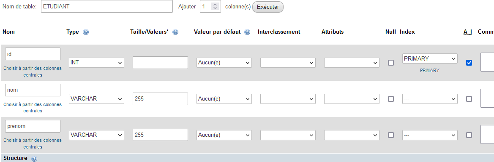

# Application de gestion des étudiants


# Base de données

Création dans PHPMyAdmin




## Requêtes à utiliser

### Lecture

- Lecture de tous les étudiants **findAll**
```sql
SELECT * FROM ETUDIANTS;
```

- Lecture d'un étudiant en fournissant son id **findOne**
```sql
SELECT * FROM ETUDIANTS WHERE ID = ....;
```